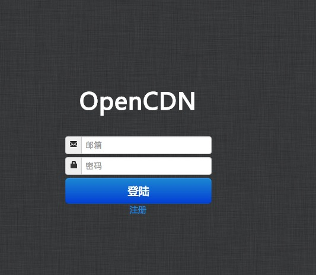

###主控端安装手册

###LAMP环境配置

**本文档以 Centos 6.x 86_64 为蓝本** 本文档约定 所有命令以#打头
	
	#wget http://dl.fedoraproject.org/pub/epel/6/x86_64/epel-release-6-8.noarch.rpm

	#wget http://58.215.133.101:801/rpm/inotify-tools-3.14-1.el6.x86_64.rpm
	
	#wget http://58.215.133.101:801/rpm/opencdn-console-1.1-2.el6-noarch.rpm

	#rpm -ivh epel-release-6-8.noarch.rpm

	#rpm -ivh inotify-tools-3.14-1.el6.x86_64.rpm

	**yum -y localinstall opencdn-console-1.1-2.el6-noarch.rpm** 推荐这么安装。会动解决依赖关系.

	检查Selinux状态

	#sestatus
	
	如果输出不为 SELinux status:    disabled .可以昨时先关闭 .命令如下：

	#setenforce 0

	永久关闭方法：

	#vim  /etc/sysconfig/selinux  把SELINUX=disabled 并重启系统

	#启动Mysql 并设置密码

	#service mysqld start  

	#/usr/bin/mysqladmin -u root password '123' 设置mysql密码

####导入数据

	#cd /usr/local/opencdn/ocdn

	#mysql -uroot -p123 -e 'create database cdn_info' 新建cdn_info数据库

	#mysql -uroot -p123 cdn_info <cdn_info.sql 导入数据

	#sed -i 's#DP#123#g' /usr/local/opencdn/ocdn/database.php 修改web 数据库配置文件数据库连接信息 (dbpass为你的真实数据库密码)

	#sed -i 's#DP#123#g' /usr/local/opencdn/conf/opencdn.conf 修改opencdn配置文件数据库密码(dbpass为你的真实数据库密码)

####重启webserver->http

	/etc/init.d/httpd restart
	
####启动opencdn

	#/etc/init.d/opencdn restart

检查一下opencdn开启状态,查看日志。查看有没有异常.
	
	#cd /var/log/opencdn/ 相看相关日志

####启动服务

	#service httpd restart

**访问http://x.x.x.x/ocdn/index.php**

**默认用户名：admin@ocdn.me  密码：ocdn.me**

####截图如下：

